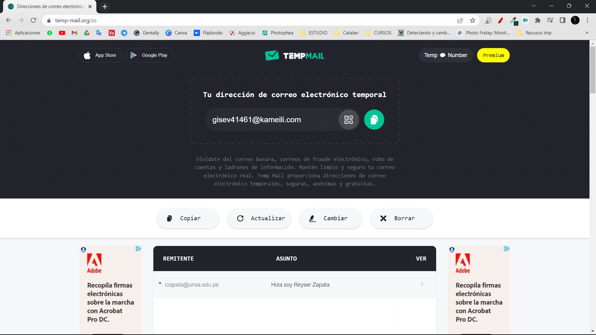

<div>
  <table width="1000px">
      <theader>
          <tr>
              <td></td>
              <th>
                  <span style="font-weight:bold;">UNIVERSIDAD NACIONAL DE SAN AGUSTIN</span><br />
                  <span style="font-weight:bold;">FACULTAD DE INGENIERÍA DE PRODUCCIÓN Y SERVICIOS</span><br />
                  <span style="font-weight:bold;">DEPARTAMENTO ACADÉMICO DE INGENIERÍA DE SISTEMAS E INFORMÁTICA</span><br />
                  <span style="font-weight:bold;">ESCUELA PROFESIONAL DE INGENIERÍA DE SISTEMAS</span>
              </th>
              <td></td>
          </tr>
      </theader>
      <tbody>
          <tr><td colspan="3"><span style="font-weight:bold;">Formato</span>: Guía de Práctica de Laboratorio</td></tr>
          <tr><td><span style="font-weight:bold;">Aprobación</span>:  2022/03/01</td><td><span style="font-weight:bold;">Código</span>: GUIA-PRLD-001</td><td><span style="font-weight:bold;">Página</span>: 1</td></tr>
      </tbody>
  </table>
</div>

<div align="center">
    <span style="font-weight:bold;">INFORME DE LABORATORIO</span><br />
</div>

<div align="center">
    <table width="1000px">
        <theader>
            <tr><th colspan="6">INFORMACIÓN BÁSICA</th></tr>
        </theader>
        <tbody>
            <tr><td>ASIGNATURA:</td><td colspan="5">Programación Web 2</td></tr>
            <tr><td>TÍTULO DE LA PRÁCTICA:</td><td colspan="5">Relaciones de uno a muchos, muchos a muchos y impresion de pdf y emails</td></tr>
            <tr><td>NÚMERO DE PRÁCTICA:</td><td>07</td><td>AÑO LECTIVO:</td><td>2023 A</td><td>NRO. SEMESTRE:</td><td width="60px">  III  </td></tr>
            <tr><td>FECHA DE PRESENTACIÓN:</td><td>14-07-2023</td><td>HORA DE PRESENTACIÓN:</td><td colspan="3">15:00</td></tr>
            <tr>
              <td colspan="4">NOMBRE:
                <ul>
                  <li>ZAPATA BUTRON REYSER JULIO</li>
                </ul>
              </td>
              <td>NOTA:</td><td></td>
            </tr>
            <tr>
              <td colspan="6" width="1000px">DOCENTES:
                <ul>
        	        <li>Anibal Sardon Paniagua</li>
                </ul>
              </td>
            </tr>
        </tbody>
    </table>
</div>

# Django

[![Git][Git]][git-site]
[![GitHub][GitHub]][github-site]
[![Vim][Vim]][vim-site]
[![Django][Django]][django-site]

## Repositorio Github

  - Link del Repositorio en github: https://github.com/ReyserLyn/Pweb-lab07.git

## OBJETIVOS TEMAS Y COMPETENCIAS

### OBJETIVOS

- **Desarrollarr** los ejercicios en los videos presentados.
- **Utilizar** diferentes librerias para lograr un resultado optimo.
- **Aprender** y produndizar más el Framework Web Django.
- **Comprender** más sobre relaciones en las Bases de Datos.

### TEMAS

- Proyectos de Django
- Aplicaciones en Django
- Base de Datos
- Creación de PDF
- Envío de Email automatico

## Actividades

Reproducir las actividades de los videos donde trabajamos:
  1. Relación de uno a muchos
  2. Relación muchos a muchos
  3. Impresión de pdfs 
  4. Envio de emails
  5. Crear su video Flipgrid


## Ejercicios Propuestos

1. Se Deberá replicar las actividades de los video donde se insertar datos y se realizan consultas de una relación de uno a muchos en una base de datos con Django.
    - <a href="https://drive.google.com/file/d/1NxYCU2yBtF7KXXwB2iiNtx_zD5NMiTTF/view">Video de insercion de datos en una BD en relación de uno a muchos</a>
<a title="Google Drive" href="https://drive.google.com/file/d/1NxYCU2yBtF7KXXwB2iiNtx_zD5NMiTTF/view"></a>
    - <a href="https://drive.google.com/file/d/1H1uLOHR2qHNH3VcZUd9JpqcACqX0UpoM/view">Video de querys en una BD en relación de uno a muchos</a>
<a title="Google Drive" href="https://drive.google.com/file/d/1H1uLOHR2qHNH3VcZUd9JpqcACqX0UpoM/view"></a>

    - Luego de replicar el código del video, ingresamos al shell por defecto de Django con el siguiente comando
     
      ```bash
      python .\manage.py shell
      ```
      

    - Ahora que estamos dentro de la shell de nuestro proyecto, podemos empezar insertando datos
      
      ```bash
      from example.models import Language, Framework
      javascript = Language(name = 'Javascript')
      javascript.save()
      angular = Framework(name = 'Angular')
      react = Framework(name = 'React')
      javascript
      angular.language = javascript
      react.language = javascript
      angular.save()
      react.save()
      vue = Framework(name='Vue', language=javascript)
      vue.save()
      ```
      

   - Nos fijamos en los cambios que hubo en la base de datos
     
     
     
     

    - Ya que ingresamos datos, podemos hacer las respectivas consultas para la tabla de Framework. **Confirmando** así que se tiene una relación de Uno a Muchos
   
      ```bash
      from example.models import Language, Framework
      Framework.objects.all()
      Framework.objects.filter(language__name='Javascript')
      Framework.objects.filter(language__name='Python')
      Framework.objects.filter(language__name__startswith='Ja')
      Framework.objects.filter(language__name__startswith='C')
      ```
      

    - Ahora realizamos consultas para la tabla de Language:
   
      ```bash
      from example.models import Language, Framework
      Language.objects.all()
      Language.objects.filter(framework__name='Angular')
      Language.objects.filter(framework__name='Spring')
      Language.objects.filter(framework__name='Django')
      ```
      

2. Se Deberá replicar las actividades de los video donde se insertar datos y se realizan consultas de una relación de muchos a muchos en una base de datos con Django.
    - <a href="https://drive.google.com/file/d/1Jpb2xC8gT3R0ZPsn_H1gWBFag8vacoac/view">Video de insercion de datos en una BD en relación de muchos a muchos</a>
<a title="Google Drive" href="https://drive.google.com/file/d/1Jpb2xC8gT3R0ZPsn_H1gWBFag8vacoac/view"></a>
    - <a href="https://drive.google.com/file/d/16Z8nzSkUnn7K6iTZ4VvAveV37piMwCM2/view">Video de querys en una BD en relación de muchos a muchos</a>
<a title="Google Drive" href="https://drive.google.com/file/d/16Z8nzSkUnn7K6iTZ4VvAveV37piMwCM2/view"></a>

    - Luego de replicar el código del video, ingresamos al shell e insertamos datos

      ```bash
      from example.models import Movie, Character
      justice_league = Movie(name='Justice League')
      justice_league.save()
      superman = Character(name='Superman')
      superman.save()
      superman.movies.add(justice_league)
      flash = Movie(name='Flash')
      wonder_woman = Movie(name='Wonder Woman 1984')
      flash_character = Character(name = 'Flash')
      flash.save()
      wonder_woman.save()
      flash_character.save()
      flash_character.movies.add(flash)
      superman.movies.add(wonder_woman)
      flash_character.movies.add(justice_league)
      superman.movies.create(name='El hombre de acero')
      ```
      
      
    - Ahora revisamos los cambios que hubo en la base de datos
      
      
      
      

      

    - Por ultimo, realizamos los querys para estas tablas y **confirmamos** su relación de muchos a muchhos, siendo gran ejemplo, Superman y Justice League
  
      ```bash
      from example.models import Movie, Character
      Character.objects.all()
      Character.objects.filter(movies__name='Justice League')
      Movie.objects.filter(character__name='Superman')
      superman = Character.objects.get(name='Superman')
      superman.movies.all()
      justice_league = Movie.objects.get(name='Justice League')
      justice_league.character_set.all()
      flash = Character.objects.get(name='Flash')
      flash.movies.all()
      ```
      
   

3. Se deberá replicar el código del siguiente video con la intención de aprender sobre la creación e impresión de pdfs con Django 

    - <a href="https://drive.google.com/file/d/1btSc7p5O_ll0CBdiLokWi89lq5yXahoN/view">Render a Django HTML Template to a PDF file Django Utility CFE Render_to_PDF</a>
<a title="Google Drive" href="https://drive.google.com/file/d/1btSc7p5O_ll0CBdiLokWi89lq5yXahoN/view"></a>

    - Se logró replicar el código siendo estos los más importantes
  
      - utils.py, es el encargado de renderizar el pdf, transformando el Html en un PDF.
        
      

      - views.py, este es el encargado de generar el pdf, dando el nombre y la información necesario al template para que esté completo.
        
      

      - template.html, es lo que recibirá información de la Vista y se transformará en PDF
      
      

    - Para poder ejecutar este ejercicio, necesitaremos seguir los siguientes pasos para poder ejecutarlo
      
      ```bash
      py -m venv venv
      ```
      ```bash
      pip install -r requirements.txt
      ```
      ```bash
      python .\manage.py runserver
      ```
      
   - Una vez hayamos seguido los comandos, podremos abrir el servidor local(http://127.0.0.1:8000/) y ver nuestro PDF

     

4. Se deberá replicar el código del siguiente video con la intención de aprender sobre el envio de Email automaticamente con Django 

    - <a href="https://drive.google.com/file/d/1JueuRhWgnXUNERTWK77lqQQgeqF1xkhK/view">Sending Emails in Django</a>
<a title="Google Drive" href="https://drive.google.com/file/d/1JueuRhWgnXUNERTWK77lqQQgeqF1xkhK/view"></a>

    - Se logró replicar el código, un proyecto y una app en Djgango, siendo los archivos más importantes los siguientes
  
      - views.py, aqui debemos colocar el Asunto, el Cuerpo, el Correo con el que se enviará y el/los correo(s) a donde llegará(destinatario). Para el ejemplo se usará correos temporales como destinatarios.
        
      

      - settings.py, aqui debemos configurar el servicio SMTP del cual haremos uso para el envío de correo, en el que debemos de colocar, dominio, puerto y el correo(user) junto con la contraseña con la que se enviará el correo, es importante que estos sean correctos. Algo importante para que funcione con el servicio SMTP de Gmail, es habilitar el acceso de aplicaciones menos seguras en tu cuenta de Gmail. Puedes hacerlo siguiendo estas instrucciones: https://support.google.com/accounts/answer/6010255
        
      

      - index.html, si todo va bien, esta página se cargará correctamente
      
      

    - Para poder ejecutar este ejercicio, necesitaremos seguir los siguientes pasos para poder ejecutarlo

      ```bash
      python .\manage.py runserver
      ```
      
   - Una vez hayamos seguido los comandos, podremos abrir el servidor local(http://127.0.0.1:8000/) y comprobar si se ha enviado el email

     
     
     

     
     
5. Realizar un video Flipgrid mostrando las ejecuciones de los ejercicios

    - Link del video: https://flip.com/s/VpYRDah9wroh 

## Commits Importantes Github

  - Para este Laboratorio, se necesitó de varios commits, en los cuales se puede apreciar el progreso que hubo para poder completar con éxito este laboratorio. En cada commit se logró implementar un ejercicio de este laboratorio.
  
  

## Autoevaluación Individual

  - Tras todo lo expuesto y mediante un consenso en grupo, se llegó a la siguiente tabla de autoevaluación
  
  
  
#

## REFERENCIAS

- https://www.w3schools.com/python/python_reference.asp
- https://docs.python.org/3/tutorial/
- https://docs.djangoproject.com/es/4.2/

#

[Git]: https://img.shields.io/badge/git-%23F05033.svg?style=for-the-badge&logo=git&logoColor=white
[git-site]: https://git-scm.com/
[GitHub]: https://img.shields.io/badge/github-%23121011.svg?style=for-the-badge&logo=github&logoColor=white
[github-site]: https://github.com/
[Vim]: https://img.shields.io/badge/VIM-%2311AB00.svg?style=for-the-badge&logo=vim&logoColor=white
[vim-site]: https://www.vim.org/
[Django]: https://img.shields.io/badge/Django-%103E2E.svg?style=for-the-badge&logo=django&logoColor=white
[django-site]: https://docs.djangoproject.com/es/4.2/

[![Git][Git]][git-site]
[![GitHub][GitHub]][github-site]
[![Vim][Vim]][vim-site]
[![Django][Django]][django-site]
